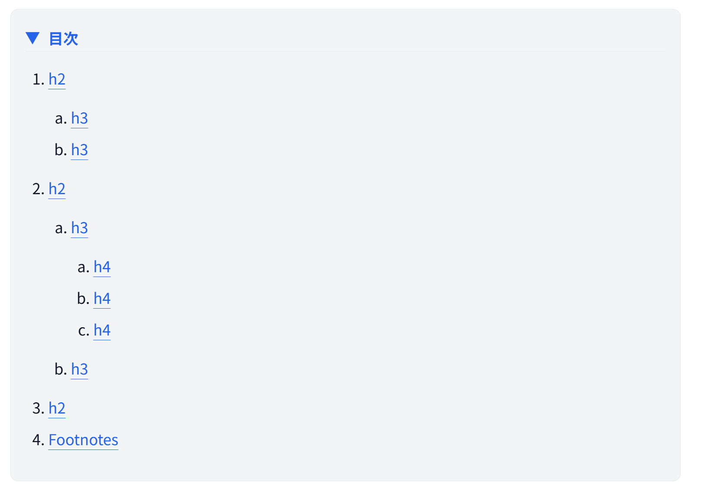

# rehype-toc

[](https://github.com/mehm8128/rehype-toc/actions/workflows/main.yml)
[](https://www.npmjs.com/package/@mehm8128/rehype-toc)
[](https://opensource.org/licenses/MIT)

rehype plugin to generate a table of contents from headings in your markdown.

You can create the table of contents as follows.



## Installation

```bash
pnpm install @mehm8128/rehype-toc
```

## Usage

### astro.config.mjs

```ts
import { rehypeCollapsableToc } from "@mehm8128/rehype-toc";

export default defineConfig({
  markdown: {
    rehypePlugins: [rehypeCollapsableToc],
  },
});
```

### rehype

```ts
import { rehype } from "rehype"
import { rehypeCollapsableToc } from "@mehm8128/rehype-toc";

const input = "<h2 id="heading-id"><a href="#heading-id">Heading</a></h2>";
const { value } = await rehype().use(rehypeCollapsableToc).process(input);
```
